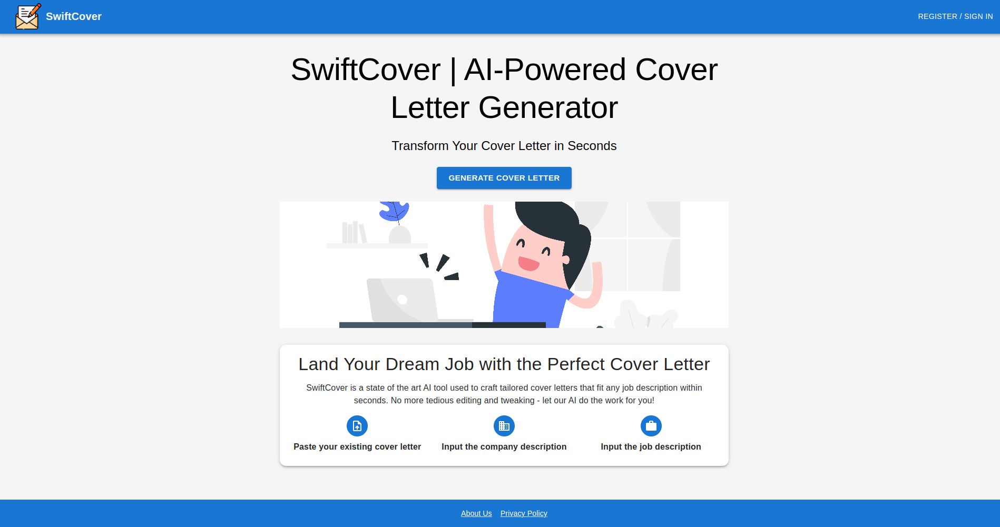
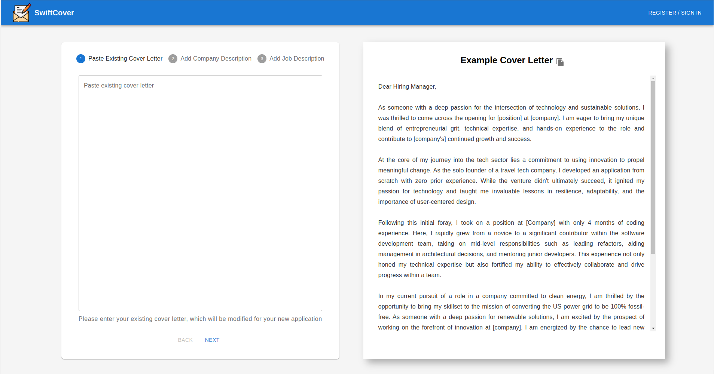
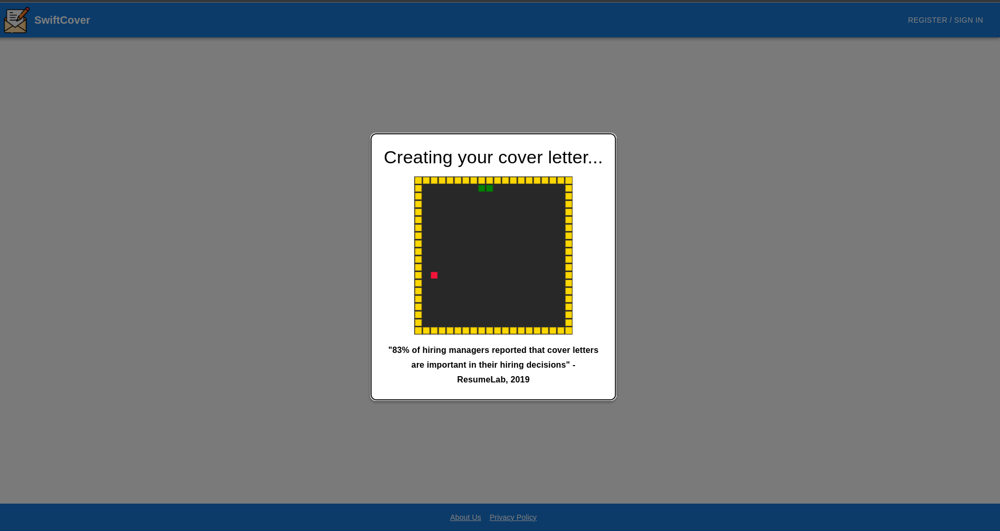
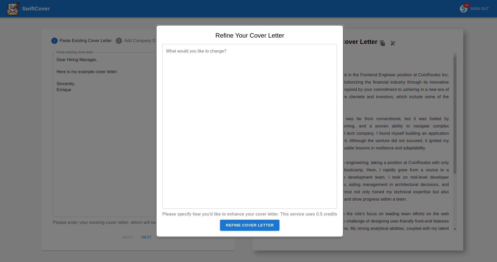
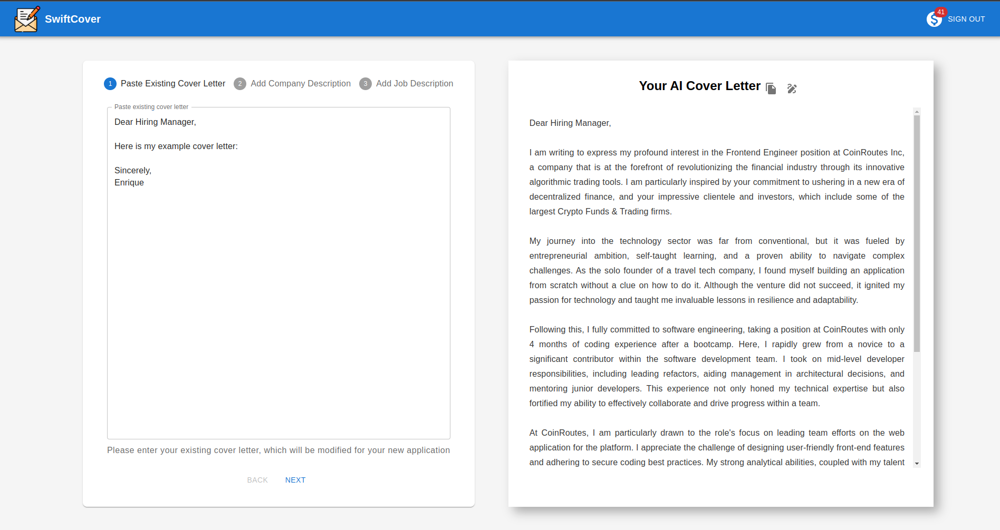

# SwiftCover

SwiftCover is a state of the art AI tool used to craft tailored cover letters that fit any job description within seconds. No more tedious editing and tweaking - let our AI do the work for you!

This project is currently generating revenues and has hundreds of users, therefore, to prevent malicious attacks and forks, I have made the repository private.

https://swiftcover.ai/

## How  it works...

Users are prompted to create an AI generated cover letter.

They follow a three step prompt to seamlesly create their cover letter.

BONUS!! They can play a classic game of snake while waiting for the cover letter to generate

Once the AI has generated the cover letter, users can refine the cover letter or simply copy and paste

And thats it! A user has an AI Generated Cover Letter in seconds!

## Tech Stack
Built on ReactJS and MUI, leveraging OpeanAI's GPT-4 Model. Firebase for authentication, cloud functions, and db. Stripe for payments
